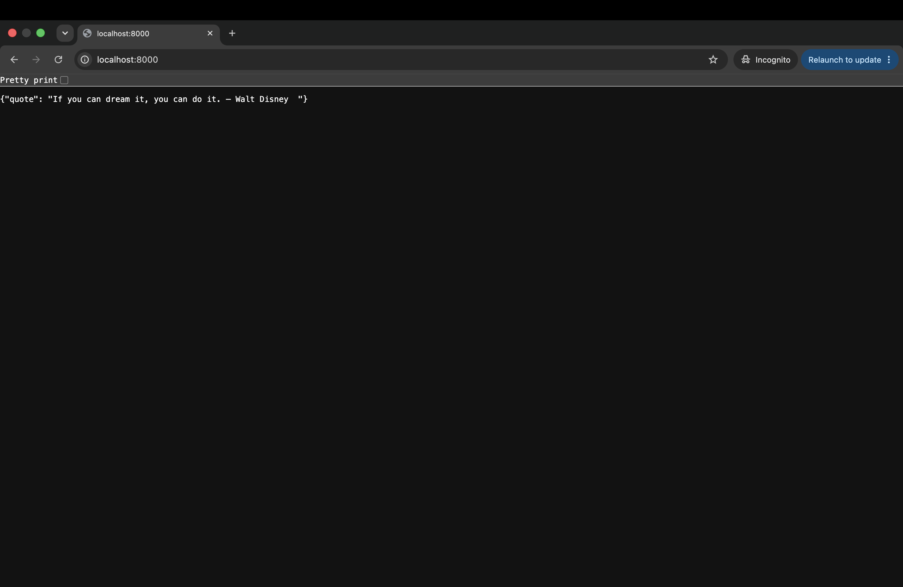

## 🔬 My Observations: Java Version vs Docker Image Size

As part of my Docker learning, I tested the same Java application using different Java versions to compare the resulting Docker image sizes.

## 🖥️ Application Output



### Image Size Comparison

| Java Version | Docker Image Size |
| ------------ | ----------------: |
| ☕ Java 21    |        **554 MB** |
| ☕ Java 24    |        **437 MB** |
| ☕ Java 25    |        **420 MB** |

### 📊 Observation

From my testing, the Docker image size varied significantly depending on the Java base image/version used.

* **Java 21:** 554 MB
* **Java 24:** 437 MB → approximately **117 MB smaller** than Java 21
* **Java 25:** 420 MB → approximately **134 MB smaller** than Java 21
* Java 25 was the **smallest among the three versions I tested**.

> **Note:** These sizes are the sizes I observed for my builds. Docker image size can vary depending on the exact base-image tag, architecture, Docker version, cached layers, and other build details. Therefore, these results should be treated as observations from this experiment rather than a universal comparison of Java versions.

### 🐳 Docker Image

I have also published the Docker image on Docker Hub so it can be pulled and tested directly.

**Docker Hub:**
https://hub.docker.com/repository/docker/shashank971/java-quotes-app/general

Pull the image using:

```bash
docker pull shashank971/java-quotes-app
```

Run it with:

```bash
docker run shashank971/java-quotes-app
```

### 💡 Key Takeaway

This experiment helped me understand that the choice of a Docker base image can have a significant impact on the final container image size.

For production-oriented applications, image size should be considered along with:

* Security
* Java support lifecycle
* Application compatibility
* Startup performance
* Build strategy
* Runtime requirements

For further optimization, approaches such as **JRE-based images** and **multi-stage Docker builds** can be explored.

---

### 📌 Experiment Context

This section represents my own observations while working with the project and does not replace the original project documentation or author's information.


# Java Motivational Quotes App

This project is a simple Java-based HTTP server that serves random motivational quotes via a REST API. The quotes are externalized to a `quotes.txt` file for easy customization.

## Features
- Serves random motivational quotes in JSON format.
- Uses an external `quotes.txt` file for configurable quotes.
- Lightweight HTTP server using `com.sun.net.httpserver.HttpServer`.
- Dockerized for easy deployment.

## Requirements
- Java 17+
- Maven (if building from source)
- Docker (optional, for containerized deployment)

## Setup and Usage

### Running Locally
1. Clone the repository:
   ```sh
   git clone https://github.com/LondheShubham153/java-quotes-app.git
   cd java-quotes-app
   ```
2. Ensure `quotes.txt` exists in the project directory and contains quotes (one per line).
3. Compile and run the application:
   ```sh
   javac src/Main.java -d out
   java -cp out Main
   ```
4. The server will start on `http://localhost:8000/`.
5. Test the API using:
   ```sh
   curl http://localhost:8000/
   ```

### Running with Docker
1. Build the Docker image:
   ```sh
   docker build -t motivational-quotes-api .
   ```
2. Run the container:
   ```sh
   docker run -p 8000:8000 motivational-quotes-api
   ```
3. Access the API at `http://localhost:8000/`.

## File Structure
```
project-root/
│── src/
│   └── Main.java
│── quotes.txt
│── Dockerfile
│── README.md
│── target/
│   └── myapp.jar (if using Maven build)
```

## Customizing Quotes
To customize the quotes, edit `quotes.txt` and restart the application. Each quote should be on a new line.

## License
This project is licensed under the MIT License.

## Author
[TrainWithShubham](https://github.com/LondheShubham153)


