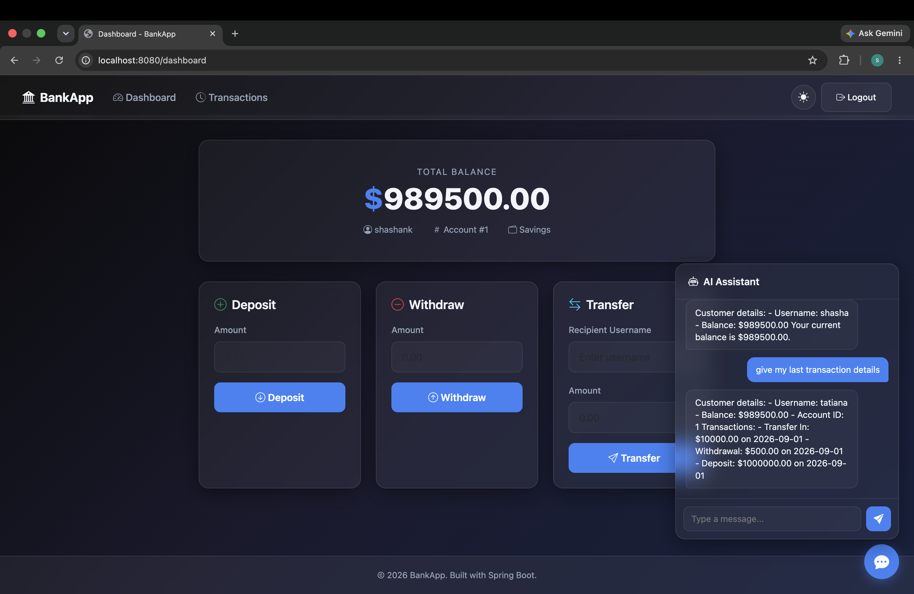

# DevSecOps Banking Application

A high-performance, containerized financial platform built with Spring
Boot 3, Java 21, and integrated Contextual AI. This project implements a
secure "DevSecOps Pipeline" using GitHub Actions, OIDC authentication,
and AWS managed services.

[](https://www.oracle.com/java/technologies/javase/jdk21-archive-downloads.html)
[](https://spring.io/projects/spring-boot)
[](.github/workflows/devsecops.yml)
[](#phase-3-security-and-identity-configuration)
:::


------------------------------------------------------------------------


### My Current Project Screenshot

The following screenshot shows the running BankApp dashboard, including
the banking operations and integrated AI Assistant.



------------------------------------------------------------------------

## My Project Understanding & Observations

This section documents my understanding of the application,
architecture, technology versions, and the practical tasks involved in
containerizing and running it.

### Project Overview

**BankApp** is a Spring Boot-based banking web application with an
integrated AI assistant. The application provides core banking
operations such as user registration/login, account balance management,
deposits, withdrawals, transfers, transaction history, and an AI chat
interface powered by **Ollama with TinyLlama**.

The application does **not** use a separate React/Angular/Next.js
frontend. The web interface is rendered by the Spring Boot application
using **Thymeleaf**, with CSS and JavaScript served from the
application's resources.

### Project Architecture

The application can be understood as a **3-tier application with an
additional AI tier**:

``` text
                         User / Browser
                              |
                              | HTTP :8080
                              v
                 +---------------------------+
                 |     Application Tier      |
                 | Spring Boot 3.4.13        |
                 | Java 21 + Thymeleaf       |
                 | Spring Security + JPA     |
                 +-------------+-------------+
                               |
                    +----------+----------+
                    |                     |
                    | JDBC                | REST
                    v                     v
             +-------------+       +-------------+
             |    MySQL    |       |   Ollama    |
             |    :3306    |       |   :11434   |
             |  Data Tier  |       |  AI Tier    |
             +-------------+       |  TinyLlama  |
                                   +-------------+
```

**Tier breakdown:**

  -----------------------------------------------------------------------
  Tier                    Implementation          Responsibility
  ----------------------- ----------------------- -----------------------
  Presentation            Thymeleaf + HTML +      User interface and
                          CSS + JavaScript        browser interaction

  Application             Spring Boot 3.4.13 +    Business logic,
                          Java 21                 security, controllers,
                                                  services and APIs

  Data                    MySQL                   Accounts and
                                                  transaction persistence

  AI                      Ollama + TinyLlama      AI assistant/contextual
                                                  responses
  -----------------------------------------------------------------------

### Application Structure

The main Java code is organized into clear application layers:

``` text
src/main/java/com/example/bankapp/
├── config/
│   └── SecurityConfig.java
├── controller/
│   ├── BankController.java
│   └── ChatController.java
├── model/
│   ├── Account.java
│   └── Transaction.java
├── repository/
│   ├── AccountRepository.java
│   └── TransactionRepository.java
├── service/
│   ├── AccountService.java
│   └── ChatService.java
└── BankappApplication.java
```

The web resources are contained inside the same Spring Boot project:

``` text
src/main/resources/
├── application.properties
├── templates/
│   ├── dashboard.html
│   ├── login.html
│   ├── register.html
│   ├── transactions.html
│   └── fragments/
└── static/
    ├── css/
    ├── js/
    └── mysql/
```

### Technology Stack & Versions

  Component            Technology / Version
  -------------------- ---------------------------------------------
  Language             Java 21
  Framework            Spring Boot 3.4.13
  Build Tool           Maven
  Web Layer            Spring Web + Thymeleaf
  Security             Spring Security 6 / Spring Security Starter
  Persistence          Spring Data JPA + Hibernate
  Database             MySQL
  AI Engine            Ollama
  AI Model             TinyLlama
  Containerization     Docker
  Orchestration        Docker Compose
  CI/CD                GitHub Actions
  Secret Scanning      Gitleaks
  Linting              Checkstyle
  SAST                 Semgrep
  SCA                  OWASP Dependency Check
  Container Security   Trivy
  DAST                 OWASP ZAP
  Registry             Amazon ECR
  Compute              Amazon EC2
  Cloud                AWS
  Identity             AWS IAM + GitHub OIDC
  Secrets              AWS Secrets Manager

### Docker Compose Services

The local containerized setup consists of:

  Service                 Container Purpose                            Port
  ----------------------- --------------------------------------- ---------
  `backend` / `bankapp`   Spring Boot banking application            `8080`
  `mysql`                 Persistent application database            `3306`
  `ollama`                Local AI inference server                 `11434`
  `ollama-pull-model`     Initializes/pulls the TinyLlama model         ---

The backend communicates with the services using Docker service names
rather than `localhost`:

``` text
MYSQL_HOST=mysql
OLLAMA_URL=http://ollama:11434
```

### Key Environment Variables

The application reads its database and AI configuration from environment
variables:

``` env
MYSQL_HOST=mysql
MYSQL_PORT=3306
MYSQL_DATABASE=bankappdb
MYSQL_USER=admin
MYSQL_PASSWORD=Test@123
MYSQL_ROOT_PASSWORD=Test
```

The AI endpoint used by the backend is:

``` text
OLLAMA_URL=http://ollama:11434
```

The application is configured to use:

``` text
ollama.model=tinyllama
```

### Main Application Tasks / Functionality

From the application code and UI, the main functional areas are:

-   User registration and login
-   Spring Security-based authentication
-   Account dashboard
-   View account balance
-   Deposit money
-   Withdraw money
-   Transfer money to another user
-   View transaction history
-   AI assistant/chat functionality
-   MySQL persistence through Spring Data JPA
-   Health monitoring through Spring Boot Actuator


### Important Ports

``` text
BankApp / Spring Boot  → 8080
MySQL                  → 3306
Ollama                 → 11434
```
