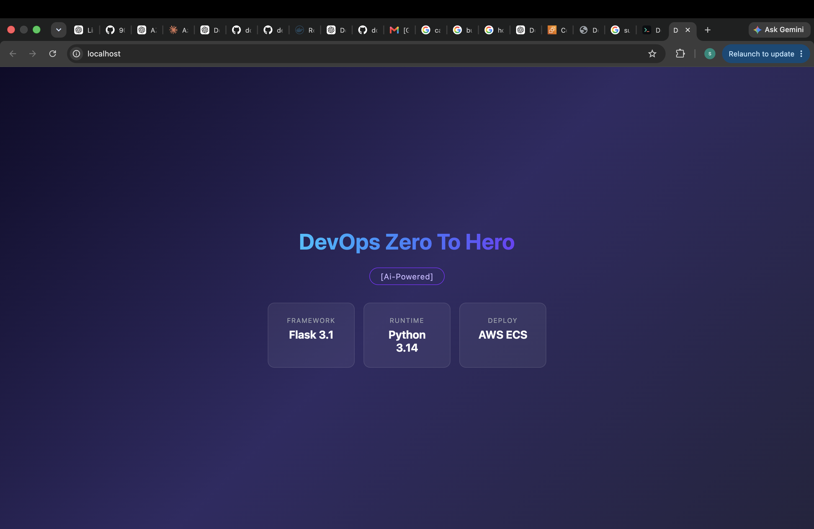

# Flask App — AWS ECS Deployment


### 🖥️ Application Output

The Flask application was successfully built and run using Docker.




The screenshot above shows the running Flask application with:

* **Flask 3.1.1**
* **Python 3.14**
* **AWS ECS** as the target deployment platform


## 👨‍💻 My Observations

I used this project as part of my hands-on learning with **Docker, Python, Flask, and AWS ECS**.

### 🐳 Docker Image

I built the application using the `python:3.14-slim` base image.

The resulting Docker image size was approximately:

> **📦 Image Size: ~200 MB**

This helped me understand how the choice of base image and installed dependencies affects the final Docker image size.

### 🔗 Docker Hub

The Docker image is available on Docker Hub:

**[https://hub.docker.com/repository/docker/shashank971/flask-app-ecs/general](https://hub.docker.com/repository/docker/shashank971/flask-app-ecs/general)**

You can pull the image using:

```bash
docker pull shashank971/flask-app-ecs:latest
```

And run it with:

```bash
docker run -p 80:80 shashank971/flask-app-ecs:latest
```


### 📊 Docker Image Size Observation

| Base Image         | Observed Image Size |
| ------------------ | ------------------: |
| `python:3.14-slim` |         **~200 MB** |

> **Note:** The image size is based on my local build. Actual image size can vary depending on the exact base image version, architecture, installed dependencies, and Docker configuration.

The project also includes a **multi-stage Dockerfile using a distroless runtime image**, which can be explored to further reduce the final image size and attack surface.

---

# Original Project Documentation

A minimal Flask web application built for learning containerization and deployment to **AWS ECS (Elastic Container Service)**.

Part of the [TrainWithShubham](https://github.com/TrainWithShubham) — DevOps Zero To Hero course.


## Features

* Responsive landing page with modern glassmorphism UI
* `/health` endpoint for ECS load balancer health checks
* Two Dockerfiles — simple and multistage (distroless)

## Tech Stack

| Component | Technology                        |
| --------- | --------------------------------- |
| Framework | Flask 3.1.1                       |
| Runtime   | Python 3.14                       |
| Container | Docker (python-slim / distroless) |
| Deploy    | AWS ECS                           |

## Project Structure

```text
flask-app-ecs/
├── app.py                 # Flask app with routes
├── run.py                 # Entry point (host 0.0.0.0, port 80)
├── requirements.txt       # Python dependencies
├── templates/
│   └── index.html         # Landing page
├── Dockerfile             # Simple single-stage build
└── Dockerfile-multi       # Multistage build with distroless
```

## Quick Start

### Run locally

```bash
pip install -r requirements.txt
python run.py
```

App runs at **http://localhost:80**.

### Run with Docker

**Simple build:**

```bash
docker build -t flask-app .
docker run -p 80:80 flask-app
```

**Multistage build (smaller, production-grade):**

```bash
docker build -f Dockerfile-multi -t flask-app .
docker run -p 80:80 flask-app
```

## Dockerfiles Explained

### Simple (`Dockerfile`)

Single-stage build using `python:3.14-slim`. Straightforward — copies everything, installs dependencies, runs the app. Good for development and learning.

### Multistage (`Dockerfile-multi`)

Two-stage build:

1. **Builder stage** — installs dependencies into a separate directory using `python:3.14-slim`
2. **Final stage** — copies only the app and deps into a `distroless` image

Benefits:

* Smaller final image (no pip, no shell, no OS utilities)
* Reduced attack surface — distroless images contain only the app and its runtime
* Better layer caching — dependencies are copied before source code

## Endpoints

| Route     | Method | Description                                       |
| --------- | ------ | ------------------------------------------------- |
| `/`       | GET    | Landing page                                      |
| `/health` | GET    | Health check (returns `Server is up and running`) |

## Deploy to AWS ECS

High-level steps to deploy this app on ECS:

1. **Push image to ECR**

   ```bash
   aws ecr get-login-password --region <region> | docker login --username AWS --password-stdin <account-id>.dkr.ecr.<region>.amazonaws.com
   docker tag flask-app:latest <account-id>.dkr.ecr.<region>.amazonaws.com/flask-app:latest
   docker push <account-id>.dkr.ecr.<region>.amazonaws.com/flask-app:latest
   ```

2. **Create ECS Task Definition** — specify the ECR image, port 80, memory/CPU limits

3. **Create ECS Service** — attach to a cluster, configure desired count, link to a load balancer

4. **Configure ALB** — target group pointing to port 80, use `/health` as the health check path

