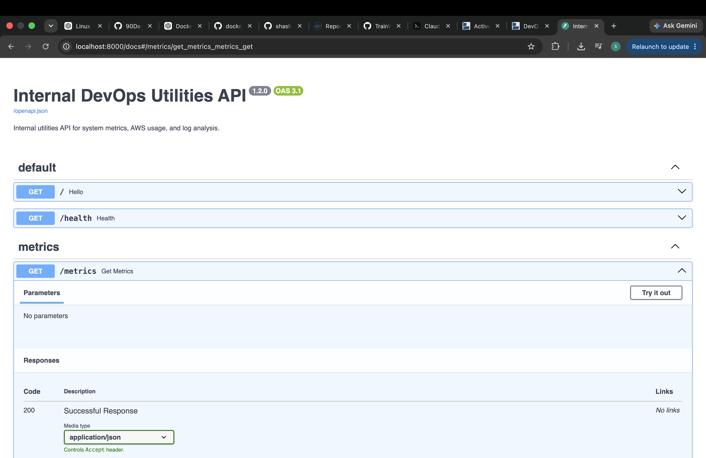

# Internal DevOps Utilities API

## 👨‍💻 My Docker Observations

I containerized this FastAPI application using Docker as part of my hands-on DevOps learning.

### 🐳 Docker Image

After building the Docker image, the resulting image size was approximately:

> **📦 Docker Image Size: ~270 MB**

This experiment helped me understand how the choice of Python base image, installed dependencies, and application configuration can affect the final Docker image size.

### 🖥️ Application Output

The FastAPI application was successfully built and run using Docker.

The application exposes an interactive **Swagger UI** with endpoints for:

* `/`
* `/health`
* `/metrics`

The `/metrics` endpoint provides system metrics through the API.



### 🔗 Docker Hub Image

The Docker image is available on Docker Hub:

**Docker Image:** `shashank971/fastapi-app`

You can pull the image using:

```bash
docker pull shashank971/fastapi-app:latest
```

Run the container using:

```bash
docker run -p 8000:8000 shashank971/fastapi-app:latest
```

Then open the Swagger UI at:

```text
http://localhost:8000/docs
```

> **Note:** The ~270 MB image size is the size observed during my build. Actual image sizes can vary depending on the Python base image, architecture, dependency versions, and Docker configuration.

---

# Original Project Documentation

## Aim

Internal API surface for common DevOps utilities, intended for internal teams:

* AWS Resources APIs
* Metrics
* Log Analysis

## Usage

```bash
git clone <repo-url>
cd devops-utilities-api
```

### setup python environment

```bash
python3 -m venv venv
source venv/bin/activate
```

### install requirements

```bash
pip install -r requirements.txt
```

### run application

```bash
python main.py
```
