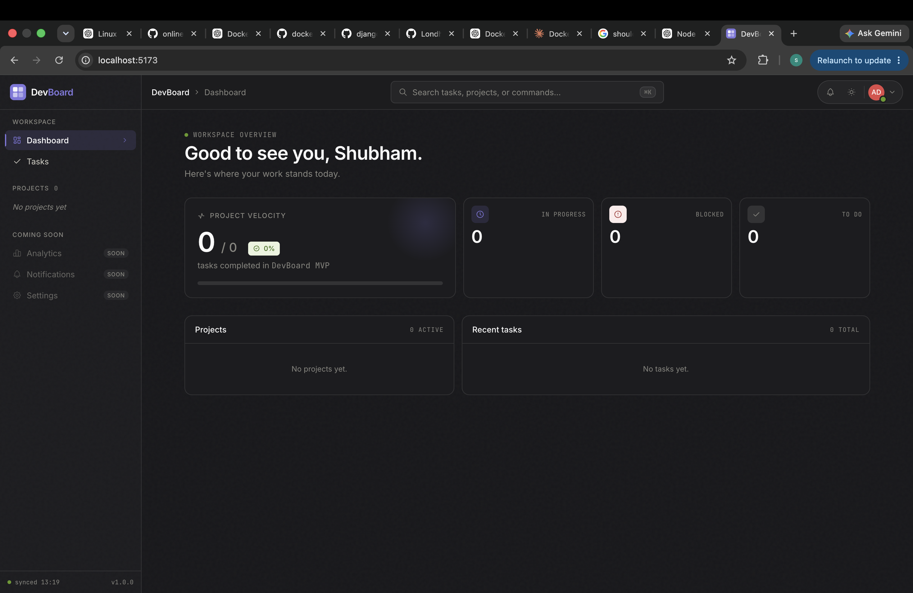

# DevBoard — React + Vite Frontend

## 👨‍💻 My Docker Observations

I containerized this DevBoard frontend as part of my hands-on Docker and DevOps learning.

### 🐳 Docker Image

I created a Docker image using **Node.js 22 Alpine** as the base image.

The resulting Docker image size was approximately:

> **📦 Image Size: ~735 MB**

This experiment helped me understand that even when using a lightweight Alpine base image, the final image can become significantly larger when the container includes the Node.js development environment, npm dependencies, and the application source.

For this project, the Dockerfile installs the dependencies with:

```bash
npm ci --legacy-peer-deps
```

and starts the Vite development server on port `5173`.

> **Note:** The ~735 MB size is the size I observed during my build. Actual image size can vary depending on the Node.js image tag, architecture, dependency versions, Docker configuration, and whether development dependencies are included.

### 🖥️ Application Output

The DevBoard application was successfully built and run through Docker.




The screenshot shows the DevBoard dashboard with:

- Workspace overview
- Project velocity
- Task status cards
- Projects section
- Recent tasks
- Dark-themed dashboard UI

### 🔗 Docker Hub

The Docker image is available on Docker Hub:

**[https://hub.docker.com/repository/docker/shashank971/devboard-ui/general](https://hub.docker.com/repository/docker/shashank971/devboard-ui/general)**

### 🚀 Run the Docker Image

Build the image:

```bash
docker build -t devboard-ui .
```

Run the container:

```bash
docker run -p 5173:5173 devboard-ui
```

Then open:

```text
http://localhost:5173
```

### 🧩 Dockerfile Used

The project uses:

```dockerfile
FROM node:22-alpine

WORKDIR /app

COPY package*.json ./

RUN npm ci --legacy-peer-deps

COPY . .

EXPOSE 5173

CMD ["npm", "run", "dev", "--", "--host", "0.0.0.0", "--port", "5173"]
```

The `.dockerignore` excludes `node_modules`, `dist`, `.git`, and `.DS_Store` from the Docker build context.

---

# Project Overview

DevBoard is a modern task and project management frontend built with React and Vite. It provides a dashboard-style interface for viewing projects, tasks, progress, and task statuses.

## ✨ Features

- Modern DevBoard dashboard UI
- Project overview
- Task management interface
- Kanban board components
- Task creation modal
- Project detail pages
- Search/command bar
- Theme toggle
- Responsive layout
- API integration through a small `fetch` wrapper
- React Router based navigation
- React Query for server-state management
- Component tests using Vitest and Testing Library

## 🛠️ Tech Stack

| Component | Technology |
|-----------|------------|
| Frontend | React 18 |
| Build Tool | Vite |
| Runtime | Node.js 22 |
| Styling | Tailwind CSS |
| Routing | React Router |
| Data Fetching | TanStack React Query |
| Icons | Tabler Icons |
| Testing | Vitest + Testing Library |
| Container | Docker |
| Base Image | `node:22-alpine` |

## 📁 Project Structure

```text
devboard-ui/
├── public/
├── src/
│   ├── api/
│   │   └── client.js
│   ├── components/
│   │   ├── layout/
│   │   ├── tasks/
│   │   └── ui/
│   ├── hooks/
│   │   └── useTasks.js
│   ├── pages/
│   │   ├── DashboardPage.jsx
│   │   └── ProjectPage.jsx
│   ├── styles/
│   ├── test/
│   ├── App.jsx
│   └── main.jsx
├── .dockerignore
├── Dockerfile
├── package.json
├── package-lock.json
├── tailwind.config.js
├── vite.config.js
└── index.html
```

## ⚙️ Local Development

Install dependencies:

```bash
npm install
```

Start the development server:

```bash
npm run dev
```

The application runs on:

```text
http://localhost:5173
```

## 🧪 Testing

Run the test suite with:

```bash
npm test
```

## 🔍 Linting

Run ESLint with:

```bash
npm run lint
```

## 🐳 Docker

Build the Docker image:

```bash
docker build -t devboard-ui .
```

Run the container:

```bash
docker run -p 5173:5173 devboard-ui
```

The Vite development server is configured to listen on `0.0.0.0`, allowing the application to be accessed through the published Docker port.

## 🔗 API / Backend

The frontend contains an API client and Vite proxy configuration for communicating with a Go backend.

For local development, `/api` requests are proxied to:

```text
http://localhost:8080
```

For Vite preview/Compose usage, the proxy is configured to communicate with a backend service named:

```text
backend:8080
```

## 📌 Docker Learning Takeaway

This project was useful for understanding an important Docker optimization concept:

> **A small base image does not automatically mean a small final image.**

Although `node:22-alpine` is relatively lightweight, installing the complete npm dependency tree and retaining development dependencies can make the final image substantially larger.

A future optimization would be to use a **multi-stage production build**:

1. Install dependencies and build the React application in a Node.js builder image.
2. Copy only the generated `dist` files into a lightweight web server such as Nginx.
3. Run the final container without the Node.js development environment or npm dependencies.

This approach can significantly reduce the final production image size.

---

## 🙏 Original Project / Author

This project was originally taken from **Shubham Londhe**.

Author / source repository:

https://github.com/LondheShubham153

The Dockerization, image-size observation, and documentation in the section above are my own hands-on work and observations.
