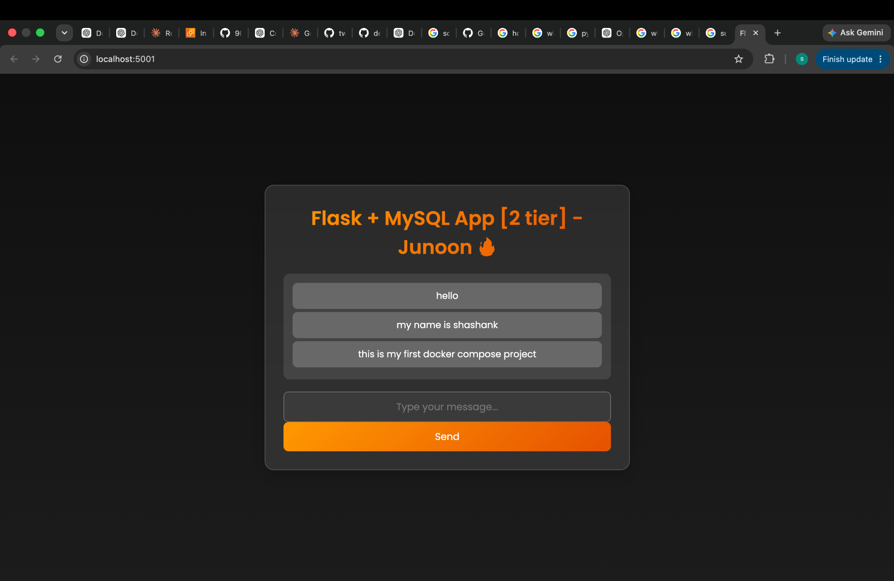

# Flask + MySQL Docker Setup

## My Docker Implementation

I containerized the Flask + MySQL two-tier application using a multi-stage Docker build and Docker Compose.

### Changes and Observations

- Added a **multi-stage Dockerfile** with separate builder and runner stages.
- Used `gcc`, `default-libmysqlclient-dev`, and `pkg-config` only in the builder stage to build `mysqlclient`.
- Used `libmariadb3` in the runner stage for the runtime MySQL client library.
- Installed Python dependencies into `/app/deps` and copied them into the runner image.
- Added a Flask `/health` endpoint and configured a container healthcheck using Python's built-in `urllib`.
- Added a MySQL healthcheck using `mysqladmin`.
- Configured Flask to wait for MySQL using `depends_on` with `service_healthy`.
- Added a persistent Docker volume for MySQL data.
- Used the Docker service name `mysql` for Flask-to-MySQL communication.
- Mapped host port `5001` to Flask container port `5000`.
- Used `linux/amd64` for MySQL 5.7 compatibility on Apple Silicon.
- Verified that both containers become **healthy** and the application works through Docker Compose.

## 📸 Application Running



The application runs at:

`http://localhost:5001`

Health endpoint:

`http://localhost:5001/health`

---

# Original Project Documentation

The following documentation is retained from the original project.

# Flask App with MySQL Docker Setup

This is a simple Flask app that interacts with a MySQL database. The app allows users to submit messages, which are then stored in the database and displayed on the frontend.

## Prerequisites

Before you begin, make sure you have the following installed:

- Docker
- Git (optional, for cloning the repository)

## Setup

1. Clone this repository (if you haven't already):

```bash
git clone https://github.com/your-username/your-repo-name.git
```

2. Navigate to the project directory:

```bash
cd your-repo-name
```

3. Create a `.env` file in the project directory to store your MySQL environment variables:

```bash
touch .env
```

4. Open the `.env` file and add your MySQL configuration:

```env
MYSQL_HOST=mysql
MYSQL_USER=your_username
MYSQL_PASSWORD=your_password
MYSQL_DB=your_database
```

## Usage

1. Start the containers using Docker Compose:

```bash
docker-compose up --build
```

2. Access the Flask app in your web browser:

- Frontend: http://localhost
- Backend: http://localhost:5000

3. Create the `messages` table in your MySQL database:

- Use a MySQL client or tool (e.g., phpMyAdmin) to execute the following SQL commands:

```sql
CREATE TABLE messages (
    id INT AUTO_INCREMENT PRIMARY KEY,
    message TEXT
);
```

4. Interact with the app:

- Visit http://localhost to see the frontend. You can submit new messages using the form.
- Visit http://localhost:5000/insert_sql to insert a message directly into the `messages` table via an SQL query.

## Cleaning Up

To stop and remove the Docker containers, press `Ctrl+C` in the terminal where the containers are running, or use the following command:

```bash
docker-compose down
```

## To run this two-tier application using without docker-compose

- First create a docker image from Dockerfile:

```bash
docker build -t flaskapp .
```

- Now, make sure that you have created a network using following command:

```bash
docker network create twotier
```

- Attach both the containers in the same network, so that they can communicate with each other.

### i) MySQL container

```bash
docker run -d     --name mysql     -v mysql-data:/var/lib/mysql     --network=twotier     -e MYSQL_DATABASE=mydb     -e MYSQL_ROOT_PASSWORD=admin     -p 3306:3306     mysql:5.7
```

### ii) Backend container

```bash
docker run -d     --name flaskapp     --network=twotier     -e MYSQL_HOST=mysql     -e MYSQL_USER=root     -e MYSQL_PASSWORD=admin     -e MYSQL_DB=mydb     -p 5000:5000     flaskapp:latest
```

## Notes

- Make sure to replace placeholders (e.g., `your_username`, `your_password`, `your_database`) with your actual MySQL configuration.
- This is a basic setup for demonstration purposes. In a production environment, you should follow best practices for security and performance.
- Be cautious when executing SQL queries directly. Validate and sanitize user inputs to prevent vulnerabilities like SQL injection.
- If you encounter issues, check Docker logs and error messages for troubleshooting.
