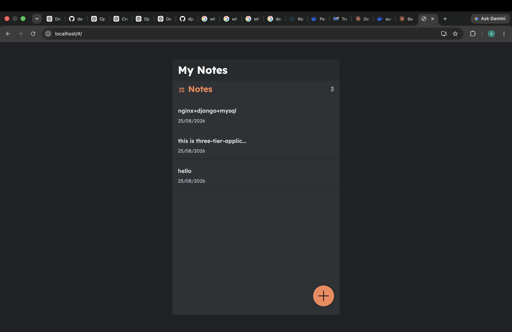

# Django Notes App — Dockerized Three-Tier Application

A full-stack notes application built with **React, Django REST Framework, MySQL, Nginx, Gunicorn, and Docker Compose**.

The project was containerized and structured as a three-tier application:

```text
                    Browser
                       |
                       v
              Nginx / React :80
                       |
              +--------+--------+
              |                 |
              v                 v
          React UI          Django API
                              :8000
                                |
                                v
                              MySQL
                              :3306
```

## Application Screenshot

The Dockerized application running successfully:



## Project Structure

```text
6.django-notes-app/
├── frontend/
│   ├── src/
│   ├── public/
│   ├── Dockerfile
│   ├── default.conf
│   ├── default-test.conf
│   ├── package.json
│   └── package-lock.json
├── backend/
│   ├── api/
│   ├── notesapp/
│   ├── manage.py
│   ├── Dockerfile
│   └── requirements.txt
├── docker-compose.yml
├── .env
├── .gitignore
├── Procfile
└── README.md
```

## Technology Stack

- React 18
- Django 4.1.5
- Django REST Framework 3.14
- MySQL 5.7
- Nginx
- Gunicorn
- Docker
- Docker Compose
- Python 3.9
- Node.js 22 Alpine

## My Contributions

### 1. Dockerized the complete application

The application was converted into a Docker-based three-tier setup:

- **Frontend container** — React production build served by Nginx
- **Backend container** — Django application served by Gunicorn
- **Database container** — MySQL 5.7 with persistent storage

Each service is connected through the `notes-app` Docker network.

### 2. Created a multi-stage backend Dockerfile

The backend uses separate builder and runtime stages.

The builder stage installs the packages required to compile Python dependencies:

```dockerfile
gcc
default-libmysqlclient-dev
pkg-config
```

Python dependencies are installed into a separate directory:

```dockerfile
RUN pip install --no-cache-dir     --prefix=/install     -r requirements.txt
```

Only the installed dependencies and application code are copied into the runtime image:

```dockerfile
COPY --from=builder /install /usr/local
COPY --from=builder /app /app
```

This keeps build-only dependencies out of the final runtime image.

### 3. Added MySQL runtime dependencies

The runtime image installs:

```text
libmariadb3
curl
```

`libmariadb3` provides the runtime library required by the MySQL client dependency, while `curl` is used by the Docker healthcheck.

Build-only MySQL development packages remain in the builder stage.

### 4. Added automatic Django migrations

The backend starts with:

```dockerfile
CMD ["sh", "-c", "python manage.py migrate --noinput && gunicorn --bind 0.0.0.0:8000 notesapp.wsgi:application"]
```

This means Django migrations are applied automatically before Gunicorn starts.

Startup flow:

```text
MySQL becomes healthy
        ↓
Backend starts
        ↓
Django migrations run
        ↓
Gunicorn starts
        ↓
Backend healthcheck passes
```

### 5. Containerized the React frontend

The frontend also uses a multi-stage build.

The builder stage:

```text
node:22-alpine
```

installs dependencies and creates the production build:

```dockerfile
RUN npm ci
RUN npm run build
```

The production build is then served using:

```text
nginx:alpine
```

Only the generated React files are copied into the Nginx image.

### 6. Configured Nginx as the frontend reverse proxy

Nginx serves the React application from:

```text
/usr/share/nginx/html
```

and routes backend requests to the Django container:

```text
/api/       → backend:8000
/admin/     → backend:8000
```

The React SPA fallback is handled with:

```nginx
try_files $uri $uri/ /index.html;
```

This allows client-side React routes to work correctly.

### 7. Preserved separate handling for Django static files

Django admin and Django REST Framework static resources are routed separately so that React's own production assets are not incorrectly proxied to Django.

```text
/static/admin/          → Django
/static/rest_framework/ → Django
```

React's frontend assets continue to be served directly by Nginx.

### 8. Added Docker healthchecks

Healthchecks were added for all three services.

#### Frontend

```yaml
test: ["CMD-SHELL", "curl -f http://localhost/ || exit 1"]
```

#### Backend

```yaml
test: ["CMD-SHELL", "curl -f http://localhost:8000/admin/ || exit 1"]
```

#### MySQL

```yaml
test: ["CMD-SHELL", "mysqladmin ping -h localhost -u $$MYSQL_USER -p$$MYSQL_PASSWORD || exit 1"]
```

This makes Docker Compose aware of the actual service health instead of only checking whether the process is running.

### 9. Added service startup dependencies

The Compose configuration uses health-based dependencies:

```yaml
backend:
  depends_on:
    db:
      condition: service_healthy
```

and:

```yaml
frontend:
  depends_on:
    backend:
      condition: service_healthy
```

Therefore the startup order is:

```text
MySQL
  ↓
healthy
  ↓
Backend
  ↓
healthy
  ↓
Frontend
```

### 10. Added persistent MySQL storage

The database uses a named Docker volume:

```yaml
volumes:
  - notes-vol:/var/lib/mysql
```

This keeps MySQL data persistent across container recreation.

### 11. Configured environment variables

Database configuration is kept in `.env` and supplied to both the backend and MySQL services.

The Django variables include:

```text
DB_NAME
DB_USER
DB_PASSWORD
DB_PORT
DB_HOST
```

The MySQL container uses:

```text
MYSQL_ROOT_PASSWORD
MYSQL_DATABASE
MYSQL_USER
MYSQL_PASSWORD
```

The application uses the Compose service name `db` as the database hostname.

## Docker Compose Services

| Service | Purpose | Port |
|---|---|---:|
| `frontend` | React production build + Nginx | 80 |
| `backend` | Django + Gunicorn | 8000 |
| `db` | MySQL database | 3306 |

## Build and Run

From the project root:

```bash
docker compose up --build
```

Run in detached mode:

```bash
docker compose up --build -d
```

Check service status:

```bash
docker compose ps
```

View logs:

```bash
docker compose logs
```

View backend logs:

```bash
docker compose logs backend
```

View frontend logs:

```bash
docker compose logs frontend
```

## Application URLs

Frontend:

```text
http://localhost
```

Django admin:

```text
http://localhost/admin/
```

REST API:

```text
http://localhost/api/notes/
```

Backend directly:

```text
http://localhost:8000
```

## Request Flow

A browser request to the frontend follows this path:

```text
Browser
   |
   | http://localhost
   v
Nginx
   |
   +---- React static files
   |
   +---- /api/* ---------> backend:8000
   |
   +---- /admin/* -------> backend:8000
                              |
                              v
                           Django
                              |
                              v
                           db:3306
                              |
                              v
                            MySQL
```

## Verification

The deployed application was verified through the Dockerized stack.

Examples:

```bash
curl -I http://localhost/
```

Expected frontend response:

```text
HTTP/1.1 200 OK
Server: nginx
```

Backend admin through Nginx:

```bash
curl -I http://localhost/admin/
```

Expected response:

```text
HTTP/1.1 302 Found
Location: /admin/login/?next=/admin/
```

API through Nginx:

```bash
curl http://localhost/api/notes/
```

The API returns the notes collection, for example:

```json
[]
```

when there are no notes.


## Key Docker Concepts Practiced

- Dockerfile design
- Multi-stage builds
- Builder vs runtime dependencies
- Python dependency installation with `--prefix`
- Runtime MySQL libraries
- Nginx configuration
- Reverse proxying
- Docker Compose
- Service networking
- Healthchecks
- `depends_on` with `service_healthy`
- Environment variables
- Named volumes
- Automatic Django migrations
- Gunicorn
- React production builds
- Containerized three-tier architecture

## Final Architecture

```text
                         ┌─────────────────────┐
                         │       Browser       │
                         └──────────┬──────────┘
                                    │
                                    │ :80
                                    ▼
                         ┌─────────────────────┐
                         │  Frontend Container │
                         │    React + Nginx    │
                         └──────────┬──────────┘
                                    │
                             /api, /admin
                                    │
                                    ▼
                         ┌─────────────────────┐
                         │ Backend Container   │
                         │ Django + Gunicorn   │
                         └──────────┬──────────┘
                                    │
                                  :3306
                                    │
                                    ▼
                         ┌─────────────────────┐
                         │   Database          │
                         │      MySQL 5.7      │
                         └─────────────────────┘
```

The application is therefore fully containerized with **React + Nginx**, **Django + Gunicorn**, and **MySQL**, with health-aware service startup and persistent database storage.
