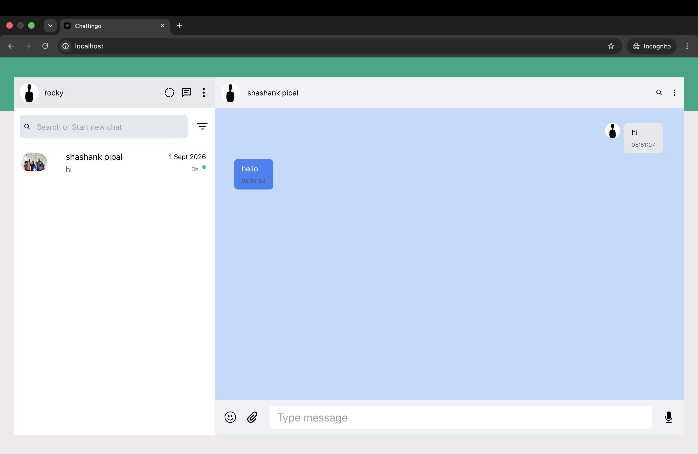

# 🚀 Chattingo — Real-Time Chat Application

Chattingo is a full-stack real-time chat application built with **React, Spring Boot, WebSocket, and MySQL**. The application was containerized using **Docker and Docker Compose**, with separate containers for the frontend, backend, and database.

## 📸 Application



The application supports user authentication, user search, one-to-one conversations, and real-time messaging.

---

## 🔍 My Observations & Contributions

### Observations

While containerizing and testing Chattingo, I observed that the application works as three independent services:

- **Frontend** handles the React UI and is served through Nginx.
- **Backend** handles authentication, APIs, database operations, and WebSocket communication.
- **MySQL** provides persistent storage for users, chats, and messages.

The main containerization considerations were service-to-service communication, environment variables, database startup ordering, health checks, and reducing final image sizes.

### Contributions

- Created **multi-stage Dockerfiles** for the frontend and backend.
- Configured the frontend with a **Node.js builder and Nginx runtime**.
- Configured the backend with a **Maven builder and Java runtime**.
- Created the **Docker Compose** setup for frontend, backend, and MySQL.
- Configured backend-to-MySQL communication using the Docker service name.
- Added a **MySQL health check** and configured the backend to wait for a healthy database.
- Configured **JWT and database environment variables**.
- Configured Nginx to serve the React production build.
- Identified and fixed an issue in the original **`HomePage.jsx`** message-handling flow.
- Removed unnecessary message-fetching triggers that were causing `getAllMessages()` to run repeatedly when a new message was sent.
- Cleaned up the **WebSocket connection and subscription flow** so the selected chat was handled correctly.
- Fixed the issue where sending a message could redirect the application to a **blank page**, while the message was still being saved.
- Tested the complete application through Docker Compose.
- Verified registration, login, user search, chat selection, and real-time messaging.
- Reduced the frontend Docker image from **2.43 GB to 28.75 MB**.
- Reduced the backend Docker image from **1.13 GB to 313.52 MB**.

---

## 📊 Final Result

The project was successfully transformed into a containerized full-stack application with:

- ✅ React frontend served by Nginx
- ✅ Spring Boot backend
- ✅ MySQL database
- ✅ JWT authentication
- ✅ WebSocket real-time messaging
- ✅ Docker multi-stage builds
- ✅ Docker Compose orchestration
- ✅ Persistent database storage
- ✅ Health-checked database service
- ✅ Significantly smaller production images


### 📦 Image Size Optimization

A major improvement was reducing the final Docker image sizes through multi-stage builds and dedicated runtime images.

| Image | Before | After |
|---|---:|---:|
| Frontend | **2.43 GB** | **28.75 MB** |
| Backend | **1.13 GB** | **313.52 MB** |


---

## 🏗️ Architecture

```text
                    ┌─────────────────────┐
                    │      Frontend       │
                    │   React + Nginx     │
                    │      Port: 80        │
                    └──────────┬──────────┘
                               │
                               │ HTTP / WebSocket
                               ▼
                    ┌─────────────────────┐
                    │       Backend       │
                    │     Spring Boot     │
                    │      Port: 8080     │
                    └──────────┬──────────┘
                               │
                               │ JDBC
                               ▼
                    ┌─────────────────────┐
                    │       MySQL         │
                    │      Port: 3306     │
                    └─────────────────────┘
```

### Services

| Service | Technology | Port |
|---|---|---:|
| Frontend | React + Nginx | 80 |
| Backend | Spring Boot | 8080 |
| Database | MySQL | 3306 |

---

## 🛠️ Technology Stack

### Frontend
- React 18
- Redux Toolkit
- Material UI
- Tailwind CSS
- React Router
- SockJS + STOMP WebSocket

### Backend
- Spring Boot 3.3.1
- Spring Security
- Spring Data JPA
- Spring WebSocket
- JWT authentication
- MySQL

### DevOps / Infrastructure
- Docker
- Docker Compose
- Multi-stage Docker builds
- Nginx
- Maven
- Eclipse Temurin

---

## ✨ Application Features

- 🔐 User registration and login
- 🔑 JWT-based authentication
- 👥 User search
- 💬 One-to-one chat
- ⚡ Real-time messaging using WebSocket
- 👨‍👩‍👧‍👦 Group chat support
- 🕒 Message timestamps
- 👤 User profile management
- 📱 Responsive interface
- 💾 Persistent messages using MySQL

---

## 🐳 Dockerization

The application was converted into a multi-container Docker setup.

### Frontend

```text
Node.js Builder
      ↓
React Production Build
      ↓
Nginx Runtime
```

The React production build is copied into the Nginx runtime image and served on port `80`.

### Backend

```text
Maven + JDK Builder
      ↓
Spring Boot JAR
      ↓
Eclipse Temurin Runtime
```

Only the packaged JAR is copied into the runtime image, keeping Maven and the build environment out of the final container.

---

## 🔗 Docker Compose

Docker Compose orchestrates the complete application:

```text
Frontend
   │
   ├── Backend
   │      │
   │      └── MySQL
   │
   └── WebSocket communication
```

The Compose setup includes:

- Frontend container
- Spring Boot backend container
- MySQL container
- Dedicated Docker network
- Persistent MySQL volume
- MySQL health check
- Backend dependency on a healthy MySQL service
- Environment-based configuration
- JWT secret configuration

### Database Communication

Inside Docker Compose, the backend connects to MySQL using the Docker service name:

```text
jdbc:mysql://mysql:3306/chattingo_db
```

Using `mysql` instead of `localhost` allows the backend container to communicate with the MySQL container through the Docker network.

---

## ⚙️ Environment Configuration

The application uses environment variables for configuration.

```env
JWT_SECRET=your-jwt-secret

SPRING_DATASOURCE_URL=jdbc:mysql://mysql:3306/chattingo_db
SPRING_DATASOURCE_USERNAME=root
SPRING_DATASOURCE_PASSWORD=your-password

MYSQL_ROOT_PASSWORD=your-password
MYSQL_DATABASE=chattingo_db
```

> Do not commit real secrets or passwords to the repository.

---

## 🚀 Running the Application

### Prerequisites

- Docker
- Docker Compose

### Start all services

```bash
docker compose up -d
```

### Check running containers

```bash
docker compose ps
```

### View logs

```bash
docker compose logs -f
```

### Stop the application

```bash
docker compose down
```

---

## 🔌 API Endpoints

```text
POST   /api/auth/register     - User registration
POST   /api/auth/login        - User login
GET    /api/users             - Get users
POST   /api/chats/create      - Create chat
GET    /api/chats             - Get user chats
POST   /api/messages/create   - Send message
GET    /api/messages/{chatId} - Get chat messages
WS     /ws                    - WebSocket endpoint
```

---

## 📂 Project Structure

```text
chattingo/
│
├── backend/
│   ├── src/main/java/
│   │   └── com/chattingo/
│   │       ├── Controller/
│   │       ├── Service/
│   │       ├── Model/
│   │       └── config/
│   ├── src/main/resources/
│   ├── Dockerfile
│   ├── Dockerfile.multi
│   ├── .env
│   └── pom.xml
│
├── frontend/
│   ├── public/
│   ├── src/
│   ├── Dockerfile
│   ├── Dockerfile.multi
│   ├── default.conf
│   ├── .env
│   └── package.json
│
├── docker-compose.yml
├── CONTRIBUTING.md
└── README.md
```

---

